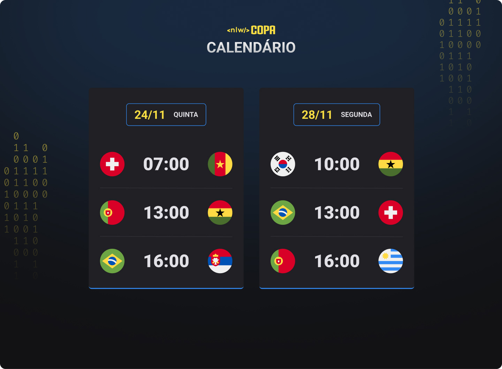

<h1 align="center"> NLW Calendário da Copa</h1>

Evento exclusivo e gratuito, promovido pela Rocketseat para ensino de tecnologias WEB.

  <a href="#-tecnologias">Tecnologias</a>&nbsp;&nbsp;&nbsp;|&nbsp;&nbsp;&nbsp;
  <a href="#-projeto">Projeto</a>&nbsp;&nbsp;&nbsp;|&nbsp;&nbsp;&nbsp;
  <a href="#-layout">Layout</a>&nbsp;&nbsp;&nbsp;|&nbsp;&nbsp;&nbsp;
  <a href="#memo-licença">Licença</a>

     

 

  

## 🚀 Tecnologias

Esse projeto foi desenvolvido com as seguintes tecnologias:

- HTML e CSS
- JavaScript e JSON
- Git e GitHub

## 💻 Projeto

O projeto é um Calendário da Copa que mostra seus dias e horários de jogos. No site é possivel mudar as cores do layout, tornando mais agrádavel para o usuário.

## 🔖 Layout

Você pode visualizar o layout do projeto através [DESSE LINK](https://www.figma.com/file/kMiWTPxYhEqKDfNOPqD5gv/Calend%C3%A1rio-de-Jogos-(Community)). É necessário ter conta no [Figma](https://figma.com) para acessá-lo.

## :memo: Licença

Esse projeto está sob a licença MIT.

---

Feito com ♥ by Ghabriel Molina :wave: [Linkedin!](www.linkedin.com/in/ghabriel-molina)
